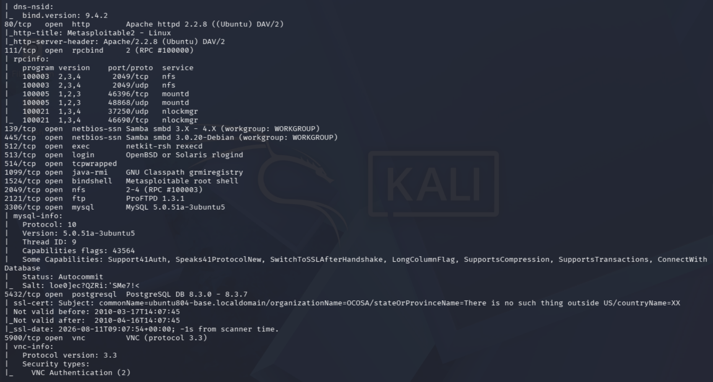
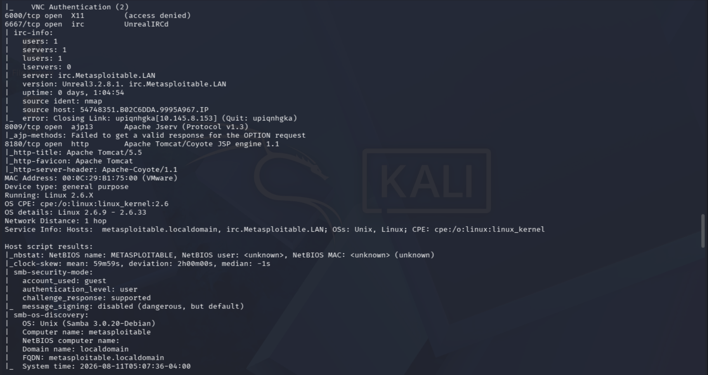
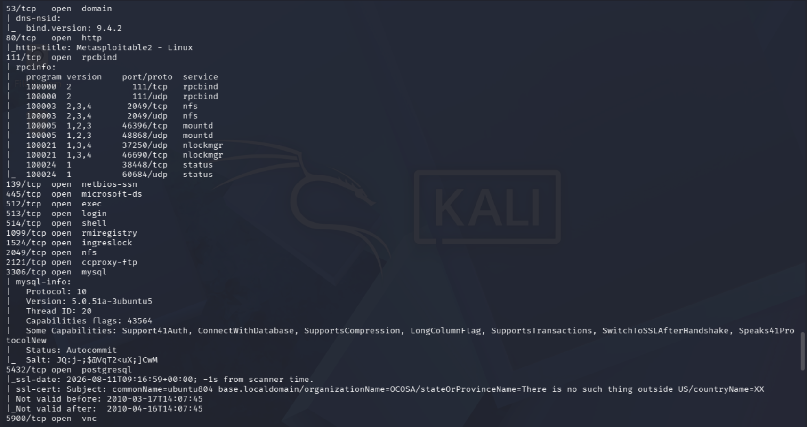
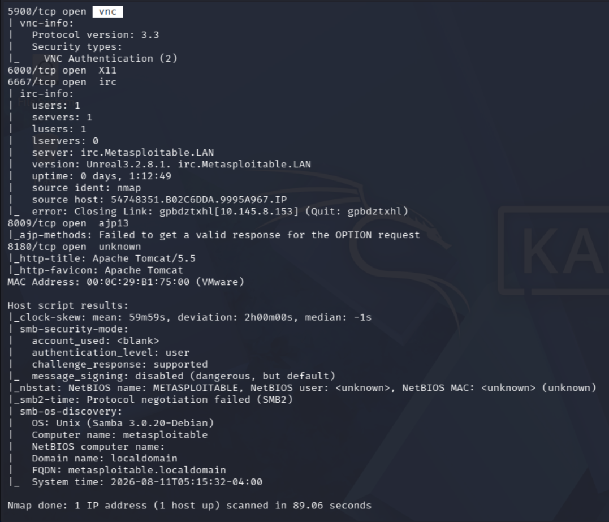

# Cybersecurity: Nmap Network Scanning

## Table of Contents
- [Introduction](#-introduction)
- [Objective](#-objective)
- [Lab Environment](#️-lab-environment)
- [Practical Tasks Executed](#-practical-tasks-executed)
  - [1. Host Discovery (Ping Sweep)](#1-host-discovery-ping-sweep)
  - [2. Comprehensive TCP Port Scanning](#2-comprehensive-tcp-port-scanning)
  - [3. UDP Port Scanning](#3-udp-port-scanning)
  - [4. Service & Version Detection](#4-service--version-detection)
  - [5. OS Detection](#5-os-detection)
  - [6. Aggressive Scan & Output](#6-aggressive-scan--output)
  - [7. NSE Script Scanning](#7-nse-script-scanning)
  - [8. Firewall Detection (ACK Scan)](#8-firewall-detection-ack-scan)
  - [9. Port State Reasoning](#9-port-state-reasoning)
- [Executive Summary & Conclusion](#-executive-summary--conclusion)
- [Ethical Guidelines & Disclaimer](#️-ethical-guidelines--disclaimer)

---

## Introduction
Port scanning and network mapping are foundational phases of network reconnaissance. Before any vulnerability assessment or penetration test can occur, an assessor must understand the topology of the target network and the exact services exposed to the network layer. 

Nmap (Network Mapper) is an industry-standard, open-source utility used to discover hosts, open ports, running services, and operating system details. In this practical lab, Nmap is utilized to systematically map the attack surface of an authorized target to gather footprinting data required for subsequent security testing.

## Objective
To perform comprehensive network reconnaissance against an authorized Metasploitable laboratory target. The objective is to identify live hosts, discover exposed TCP/UDP ports, enumerate service versions, and detect potential vulnerabilities using the Nmap Scripting Engine (NSE).

## Lab Environment
*   **Operating System:** Kali Linux
*   **Attacker IP:** `10.145.8.153`
*   **Target Environment:** Local Virtual Laboratory Network
*   **Target System:** Metasploitable 2
*   **Target IP:** `10.145.8.91`
*   **Tool Used:** Nmap 7.99

---

## Practical Tasks Executed

### 1. Host Discovery (Ping Sweep)
**Objective:** To identify live hosts on the local subnet without performing a full, noisy port scan.

**Command Executed:**
`nmap -sn 10.145.8.0/24`

**Command Breakdown:**
*   `nmap`: The network discovery and security auditing utility.
*   `-sn`: Instructs Nmap to perform a "Ping Scan" only, relying on ICMP echoes and ARP requests.
*   `10.145.8.0/24`: The target subnet block.

**Methodology:** 
I initiated a subnet-wide sweep to map out active devices without engaging port-specific probes. This method is utilized to efficiently locate targets while minimizing network traffic and IDS (Intrusion Detection System) alerts.

**Observation:** 
The scan successfully identified 4 active hosts on the `10.145.8.0/24` subnet. The primary target machine (`10.145.8.91`) was confirmed to be online with a low latency of 0.0014s, allowing me to narrow the scope of deeper enumeration exclusively to this IP.

**Security Relevance:**
Host discovery is the critical first step in footprinting a network, ensuring that time and packets are not wasted scanning dead IP addresses.

**Result / Evidence:**
 

---

### 2. Comprehensive TCP Port Scanning
**Objective:** To identify the complete exposed TCP attack surface of the target system.

**Command Executed:**
`nmap -p- 10.145.8.91`

**Command Breakdown:**
*   `nmap`: The network scanning utility.
*   `-p-`: Instructs Nmap to aggressively scan all 65,535 TCP ports instead of defaulting to the top 1,000.

**Methodology:** 
Targeting the confirmed active host, I executed a full TCP port scan across the entire possible port range. I specifically omitted stealth flags to observe how the target handles standard TCP connection attempts across all ports.

**Observation:** 
The target revealed a massive attack surface. Nmap reported 65,505 closed ports, but highlighted a significant number of open standard ports (e.g., FTP on 21, SSH on 22, HTTP on 80, SMB on 445). Additionally, several high-numbered/non-standard ports were discovered open.

**Security Relevance:**
Scanning the entire port range ensures that hidden services or malicious backdoors running on obscure, high-numbered ports are not missed during the reconnaissance phase.

**Result / Evidence:**
 

---

### 3. UDP Port Scanning
**Objective:** To discover open UDP ports and connectionless services running on the target.

**Command Executed:**
`sudo nmap -sU -F 10.145.8.91`

**Command Breakdown:**
*   `sudo`: Runs Nmap with elevated privileges, required for raw UDP packet crafting.
*   `-sU`: Instructs Nmap to perform a UDP scan.
*   `-F`: Enables "Fast mode," scanning the top 100 most common UDP ports.

**Methodology:** 
Because UDP is a connectionless protocol, scanning can be incredibly slow. I utilized the `-F` flag to rapidly probe the most common UDP services, sending protocol-specific payloads to trigger a response.

**Observation:** 
The scan successfully identified key UDP services, notably port 53 (Domain/DNS), 111 (rpcbind), and 2049 (nfs). It also detected filtered ports like DHCP and NetBIOS, which expands the target's attack surface beyond typical TCP web or file transfer services.

**Security Relevance:**
Critical infrastructure services often rely on UDP. Identifying exposed UDP services is essential for discovering vulnerabilities that are frequently overlooked by administrators who focus solely on securing TCP traffic.

**Result / Evidence:**
 

---

### 4. Service & Version Detection
**Objective:** To enumerate the exact software and versions running behind the discovered open ports.

**Command Executed:**
`nmap -sV 10.145.8.91`

**Command Breakdown:**
*   `-sV`: Probes open ports to determine service and version info by analyzing the banners and responses returned by the applications.

**Methodology:** 
Having mapped the open TCP ports, I re-scanned them using version detection. Nmap established connections with the open ports and interrogated the service banners to extract software names and release versions.

**Observation:** 
The scan extracted highly actionable intelligence. I identified severely outdated and notoriously vulnerable software versions, such as `vsftpd 2.3.4` (known for a malicious backdoor) and `Apache httpd 2.2.8`. 

**Security Relevance:**
An open port alone does not equal a vulnerability. Version detection is the most critical step for vulnerability mapping, as it allows the assessor to cross-reference the running software against the CVE (Common Vulnerabilities and Exposures) database.

**Result / Evidence:**
 

---

### 5. OS Detection
**Objective:** To fingerprint the target's underlying operating system.

**Command Executed:**
`sudo nmap -O 10.145.8.91`

**Command Breakdown:**
*   `sudo`: Requires root privileges to send custom TCP and UDP packets.
*   `-O`: Enables operating system detection by analyzing the specific ways the target's TCP/IP stack responds to various probes.

**Methodology:** 
I utilized Nmap's TCP/IP stack fingerprinting engine. By sending a series of malformed and standard packets, Nmap analyzed the target's responses (like TCP sequence predictability and IP ID generation) and compared them to its internal OS database.

**Observation:** 
Nmap successfully fingerprinted the target as running a Linux kernel (specifically identified within the 2.6.9 - 2.6.33 range). The network distance was logged at exactly 1 hop, confirming it is directly adjacent on the local lab network.

**Security Relevance:**
Identifying the exact OS architecture is crucial for exploit selection. A payload designed for a Windows kernel will fail against a Linux target; precise OS detection ensures subsequent exploitation attempts are targeted and effective.

**Result / Evidence:**
 

---

### 6. Aggressive Scan & Output
**Objective:** To perform a comprehensive, multi-layered scan and document the results for reporting.

**Command Executed:**
`nmap -A -oN scan_report.txt 10.145.8.91`

**Command Breakdown:**
*   `-A`: Enables "Aggressive" mode, which bundles OS detection, version detection, script scanning, and traceroute into a single command.
*   `-oN scan_report.txt`: Outputs the scan results in a normal, human-readable format to a text file for documentation.

**Methodology:** 
I executed an aggressive, all-in-one scan against the target to pull maximum intelligence. Crucially, I utilized the output flag to pipe the terminal results directly into a permanent text file for off-line analysis and report generation.

**Observation:** 
The comprehensive output yielded deep technical insights that standard scans missed, including SSH host keys, precise FTP server configurations, and SSL/TLS certificate details (showing an expired certificate from 2010).

**Security Relevance:**
Thorough documentation is a core requirement of professional security engineering. Saving the output ensures that the assessor has an immutable, exact record of the network state at the time of the scan.

**Result / Evidence:**
 

---

### 7. NSE Script Scanning
**Objective:** To automate the detection of common vulnerabilities and misconfigurations using Nmap's built-in scripting engine.

**Command Executed:**
`nmap -sC 10.145.8.91`

**Command Breakdown:**
*   `-sC`: Runs a scan using the default set of NSE (Nmap Scripting Engine) scripts. This is equivalent to `--script=default`.

**Methodology:** 
I engaged the Nmap Scripting Engine to go beyond passive version detection. Nmap ran a suite of safe, default scripts that actively attempted to interact with the target's services to check for known misconfigurations.

**Observation:** 
The NSE scripts provided immediate, actionable findings. Most notably, the script interacting with port 21 confirmed that the FTP server allows "Anonymous FTP login" (FTP code 230). 

**Security Relevance:**
NSE scripts automate the discovery of "low-hanging fruit." Confirming issues like anonymous logins or default credentials saves time and provides an immediate entry point into the system without requiring complex exploitation.

**Result / Evidence:**
 

---

### 8. Firewall Detection (ACK Scan)
**Objective:** To determine if a stateful firewall is filtering traffic to the target's critical ports.

**Command Executed:**
`sudo nmap -sA -p 21,22,23,25,53,80,111,139,445 10.145.8.91`

**Command Breakdown:**
*   `sudo`: Elevated privileges required for raw packet manipulation.
*   `-sA`: Performs a TCP ACK scan. It sends an ACK packet to see if a firewall drops it or if the target responds with an RST (Reset) packet.
*   `-p`: Specifies the comma-separated list of previously discovered open ports to test.

**Methodology:** 
I constructed an ACK scan targeting the most critical exposed ports. Because ACK packets do not initiate a new connection, a stateful firewall will typically drop them (resulting in a "filtered" state), while an unfiltered machine will respond with a TCP RST.

**Observation:** 
All tested ports returned an "unfiltered" state. This explicitly indicates that there is no stateful firewall, iptables rule, or IDS actively blocking or dropping packets between the Kali attack machine and the target services.

**Security Relevance:**
Mapping the defensive perimeter is critical. Understanding whether ports are "open" versus "filtered" allows an assessor to deduce the network's firewall rulesets and plan evasion techniques if defensive measures are active.

**Result / Evidence:**
 

---

### 9. Port State Reasoning
**Objective:** To validate exactly *why* Nmap classified a port as open, closed, or filtered by analyzing the raw packet response.

**Command Executed:**
`nmap --reason 10.145.8.91`

**Command Breakdown:**
*   `--reason`: Forces Nmap to display the exact packet type or network condition (e.g., `syn-ack`, `conn-refused`, `no-response`) that caused it to assign a specific state to a port.

**Methodology:** 
To verify the integrity of the scan data, I utilized the `--reason` flag. This forced Nmap to expose the underlying TCP/IP handshake logic it used to determine the port state, rather than just trusting the abstracted output.

**Observation:** 
Nmap explicitly reported `syn-ack` as the reason for classifying the ports as open. This confirms that the target system is actively receiving my SYN packets and completing the second step of the three-way handshake normally.

**Security Relevance:**
Relying on the `--reason` flag demonstrates a deep, engineering-level understanding of network protocols. By analyzing literal response packets, an assessor can troubleshoot false positives and verify that network appliances aren't spoofing responses.

**Result / Evidence:**
 

---

## Executive Summary & Conclusion
The reconnaissance phase successfully mapped the internal lab target (`10.145.8.91`), revealing a Linux system with a massive, intentionally insecure footprint. By systematically progressing from host discovery to deep version and NSE script enumeration, I identified multiple critical exposures. 

The most alarming findings include highly outdated daemons—such as `vsftpd 2.3.4`—and severe misconfigurations, like unauthenticated anonymous FTP access. Furthermore, the ACK scan confirmed a complete lack of stateful firewall filtering on critical ports. From a network engineering perspective, the broad range of exposed TCP and UDP services combined with the lack of perimeter filtering highlights a complete failure of defense-in-depth architecture. 

The footprinting data gathered in this exercise provides a complete blueprint of the target's attack surface, perfectly setting the stage for the vulnerability assessment and exploitation phases.

---

## Ethical Guidelines & Disclaimer
This project was conducted entirely within a private, self-hosted Virtual Machine laboratory network. The target machine (Metasploitable 2) is intentionally designed to be highly vulnerable to serve as a safe environment for educational research and cybersecurity skill development. 

All scanning, enumeration, and testing were performed strictly within this isolated, authorized environment. **I do not endorse, encourage, or perform unauthorized network scanning, reconnaissance, or penetration testing against public, corporate, or third-party infrastructure without explicit, written legal consent.**
