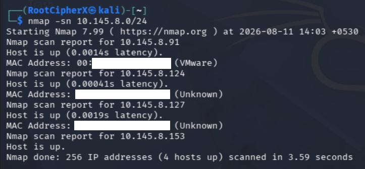
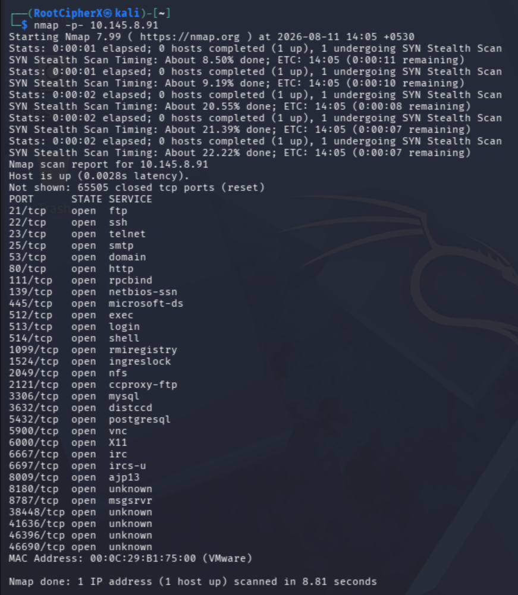
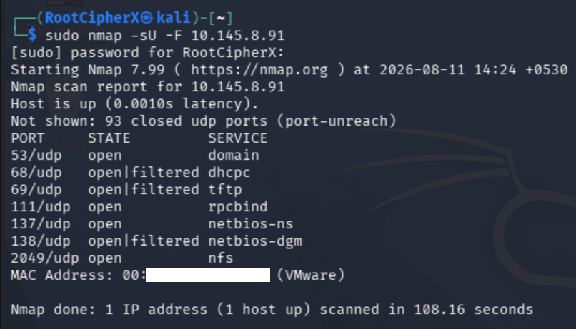
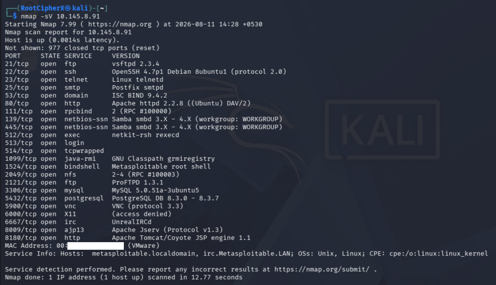
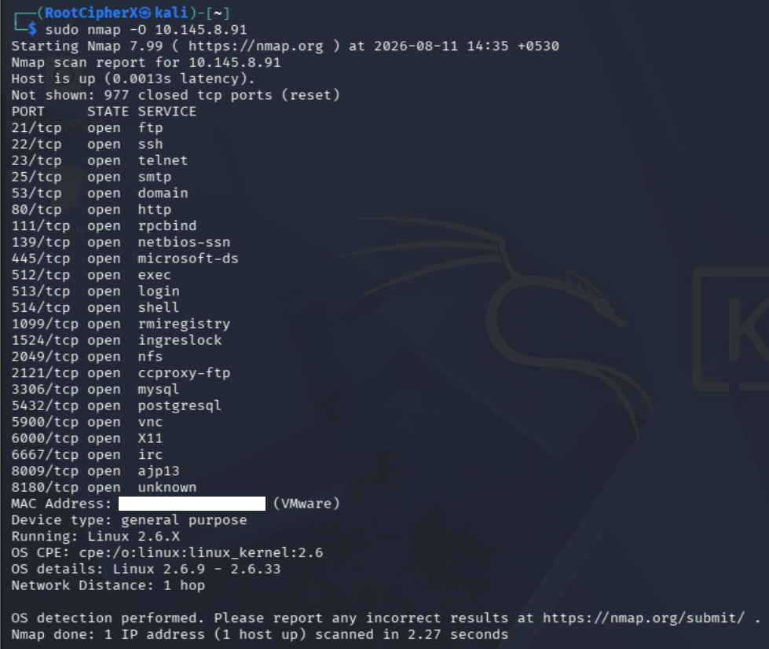
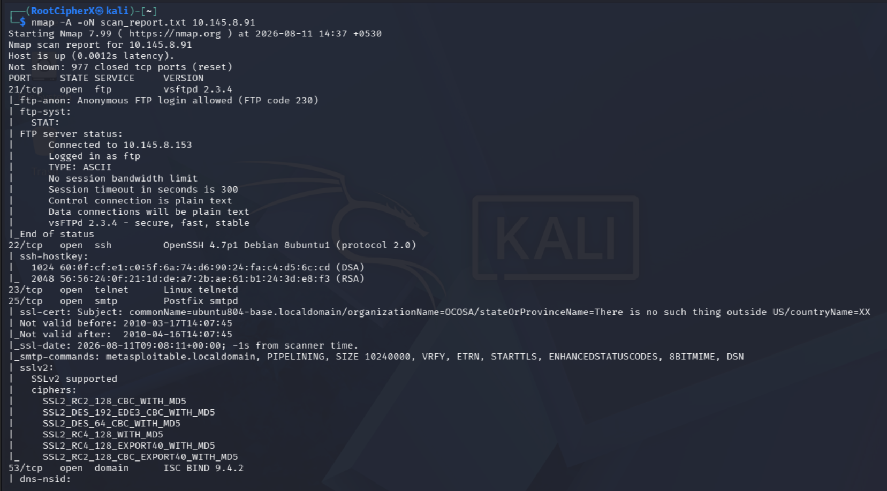
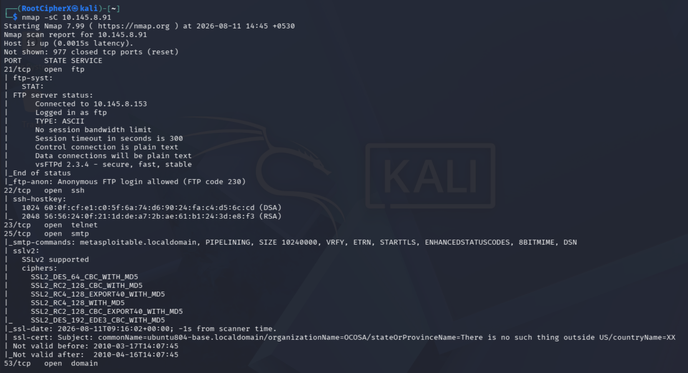
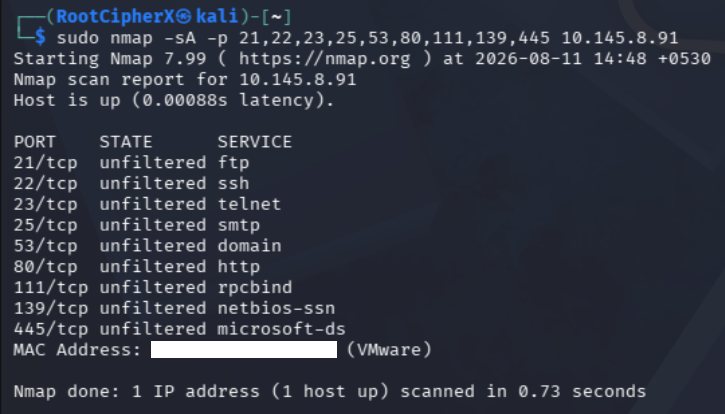
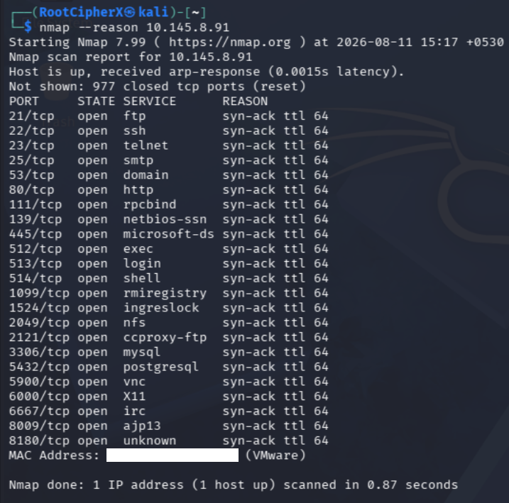

# 🔍 Cybersecurity: Nmap Network Scanning

## 📖 Table of Contents
- [Introduction](#-introduction)
- [Objective](#-objective)
- [Lab Environment](#️-lab-environment)
- [Practical Tasks Executed](#-practical-tasks-executed)
  - [1. Host Discovery (Ping Sweep)](#1-host-discovery-ping-sweep)
  - [2. Comprehensive TCP Port Scanning](#2-comprehensive-tcp-port-scanning)
  - [3. UDP Port Scanning](#3-udp-port-scanning)
  - [4. Service & Version Detection](#4-service--version-detection)
  - [5. OS Detection](#5-os-detection)
  - [6. Aggressive Scan & Output](#6-aggressive-scan--output)
  - [7. NSE Script Scanning](#7-nse-script-scanning)
  - [8. Firewall Detection (ACK Scan)](#8-firewall-detection-ack-scan)
  - [9. Port State Reasoning](#9-port-state-reasoning)
- [Scan Report & Conclusion](#-scan-report--conclusion)
- [Authorization & Disclaimer](#️-authorization--disclaimer)

---

## 📖 Introduction
Port scanning and network mapping are foundational phases of network reconnaissance. Before any vulnerability assessment or penetration test can occur, an assessor must understand the topology of the target network and the exact services exposed to the network layer. 

Nmap (Network Mapper) is an industry-standard, open-source utility used to discover hosts, open ports, running services, and operating system details. In this practical lab, Nmap is utilized to systematically map the attack surface of an authorized target to gather footprinting data required for subsequent security testing.

## 🎯 Objective
To perform comprehensive network reconnaissance against an authorized Metasploitable laboratory target. The objective is to identify live hosts, discover exposed TCP/UDP ports, enumerate service versions, and detect potential vulnerabilities using the Nmap Scripting Engine (NSE).

## 🛠️ Lab Environment
*   **Operating System:** Kali Linux
*   **Attacker IP:** `10.145.8.153`
*   **Target Environment:** Local Virtual Laboratory Network
*   **Target System:** Metasploitable 2
*   **Target IP:** `10.145.8.91`
*   **Tool Used:** Nmap 7.99

---

## 🚀 Practical Tasks Executed

### 1. Host Discovery (Ping Sweep)
**Objective:** To identify live hosts on the local subnet without performing a full, noisy port scan.

**Command Executed:**
`nmap -sn 10.145.8.0/24`

**Command Breakdown:**
*   `nmap`: The network discovery and security auditing utility.
*   `-sn`: Instructs Nmap to perform a "Ping Scan" only. It disables port scanning, relying on ICMP echoes and ARP requests to determine which hosts are online.
*   `10.145.8.0/24`: The target subnet block.

**Security Relevance:**
Host discovery is the first step in footprinting a network. By disabling port scanning, the assessor generates less network traffic, making the reconnaissance phase stealthier while successfully mapping active devices on the segment.

**Result / Evidence:**
 

---

### 2. Comprehensive TCP Port Scanning
**Objective:** To identify the complete exposed TCP attack surface of the target system.

**Command Executed:**
`nmap -p- 10.145.8.91`

**Command Breakdown:**
*   `nmap`: The network scanning utility.
*   `-p-`: Instructs Nmap to aggressively scan all 65,535 TCP ports instead of defaulting to the top 1,000 most common ports.
*   `10.145.8.91`: The authorized Metasploitable target IP.

**Security Relevance:**
Identifying open ports is critical for determining the exposed attack surface. Scanning the entire port range ensures that services hidden on non-standard, high-numbered ports (often used for backdoors or internal testing) are not missed during the assessment.

**Result / Evidence:**
 

---

### 3. UDP Port Scanning
**Objective:** To discover open UDP ports and connectionless services running on the target.

**Command Executed:**
`sudo nmap -sU -F 10.145.8.91`

**Command Breakdown:**
*   `sudo`: Runs Nmap with elevated privileges, which is required to craft and send raw UDP packets.
*   `-sU`: Instructs Nmap to perform a UDP scan.
*   `-F`: Enables "Fast mode," scanning the top 100 most common UDP ports to optimize scan time.

**Security Relevance:**
Many assessors focus purely on TCP, but critical infrastructure services (like DNS, DHCP, and SNMP) rely on UDP. Identifying exposed UDP services is essential for discovering vulnerabilities that are often overlooked by standard perimeter defenses.

**Result / Evidence:**
 

---

### 4. Service & Version Detection
**Objective:** To enumerate the exact software and versions running behind the discovered open ports.

**Command Executed:**
`nmap -sV 10.145.8.91`

**Command Breakdown:**
*   `-sV`: Probes open ports to determine service and version info by analyzing the banners and responses returned by the applications.

**Security Relevance:**
An open port alone does not indicate a vulnerability. Version detection is the most critical step for vulnerability mapping, as it allows the assessor to cross-reference the running software (e.g., vsftpd 2.3.4) against databases of known CVEs (Common Vulnerabilities and Exposures).

**Result / Evidence:**
 

---

### 5. OS Detection
**Objective:** To fingerprint the target's underlying operating system.

**Command Executed:**
`sudo nmap -O 10.145.8.91`

**Command Breakdown:**
*   `sudo`: Requires root privileges to send custom TCP and UDP packets.
*   `-O`: Enables operating system detection by analyzing the specific ways the target's TCP/IP stack responds to various probes (such as sequence predictability and initial window size).

**Security Relevance:**
Identifying the OS allows an assessor to narrow down the scope of potential exploits. A payload designed for a Windows kernel will fail against a Linux target; precise OS detection ensures that subsequent exploitation attempts are targeted and effective.

**Result / Evidence:**
 

---

### 6. Aggressive Scan & Output
**Objective:** To perform a comprehensive, multi-layered scan and document the results for reporting.

**Command Executed:**
`nmap -A -oN scan_report.txt 10.145.8.91`

**Command Breakdown:**
*   `-A`: Enables "Aggressive" mode, which bundles OS detection, version detection, script scanning, and traceroute into a single command.
*   `-oN scan_report.txt`: Outputs the scan results in a normal, human-readable format to a text file for documentation.

**Security Relevance:**
Thorough documentation is a core requirement of professional security assessments. Saving the output ensures that the assessor has an immutable record of the network state at the time of the scan for use in the final penetration testing report.

**Result / Evidence:**
 

---

### 7. NSE Script Scanning
**Objective:** To automate the detection of common vulnerabilities and misconfigurations using Nmap's built-in scripting engine.

**Command Executed:**
`nmap -sC 10.145.8.91`

**Command Breakdown:**
*   `-sC`: Runs a scan using the default set of NSE (Nmap Scripting Engine) scripts. This is equivalent to `--script=default`.

**Security Relevance:**
NSE scripts go beyond simple version detection by actively attempting to interact with the services (e.g., checking for anonymous FTP access or default credentials). This provides immediate, actionable intelligence on "low-hanging fruit" vulnerabilities.

**Result / Evidence:**
 

---

### 8. Firewall Detection (ACK Scan)
**Objective:** To determine if a stateful firewall is filtering traffic to the target's critical ports.

**Command Executed:**
`sudo nmap -sA -p 21,22,23,25,53,80,111,139,445 10.145.8.91`

**Command Breakdown:**
*   `sudo`: Elevated privileges required for raw packet manipulation.
*   `-sA`: Performs a TCP ACK scan. Instead of trying to open a connection, it sends an ACK packet to see if a firewall drops it or if the target responds with an RST (Reset) packet.
*   `-p`: Specifies the comma-separated list of previously discovered open ports to test.

**Security Relevance:**
ACK scans do not determine if a port is "open" or "closed," but rather if it is "filtered" or "unfiltered." This allows the assessor to map out the network's firewall rulesets and plan evasion techniques if defensive measures are actively blocking traffic.

**Result / Evidence:**
 

---

### 9. Port State Reasoning
**Objective:** To validate exactly *why* Nmap classified a port as open, closed, or filtered by analyzing the raw packet response.

**Command Executed:**
`nmap --reason 10.145.8.91`

**Command Breakdown:**
*   `--reason`: Forces Nmap to display the exact packet type or network condition (e.g., `syn-ack`, `conn-refused`, `no-response`) that caused it to assign a specific state to a port.

**Security Relevance:**
This demonstrates a deep, engineering-level understanding of the TCP/IP stack. By analyzing the literal response packets, an assessor can troubleshoot false positives, understand unusual network behavior, and verify that the target system is responding exactly as expected.

**Result / Evidence:**
 

---

## 📊 Scan Report & Conclusion
The comprehensive network scanning phase successfully mapped the topology and attack surface of the authorized Metasploitable 2 target (`10.145.8.91`). The scans revealed a highly vulnerable Linux-based system exposing multiple critical services, including FTP (vsftpd 2.3.4), SSH, Telnet, and an insecure Apache web server. The integration of version detection and NSE scripting confirmed several severe misconfigurations, such as anonymous FTP login access. Additionally, ACK scanning confirmed the absence of stateful firewall filtering on the tested ports. These results provide the foundational intelligence required to proceed to the vulnerability assessment and exploitation phases.

---

## ⚖️ Authorization & Disclaimer
This activity was performed against an authorized, locally hosted virtual laboratory environment containing a deliberately vulnerable Metasploitable target. This project was conducted strictly for educational and cybersecurity training purposes. Network scanning, reconnaissance, and penetration testing should **only** be performed against systems for which explicit, written authorization has been obtained.
